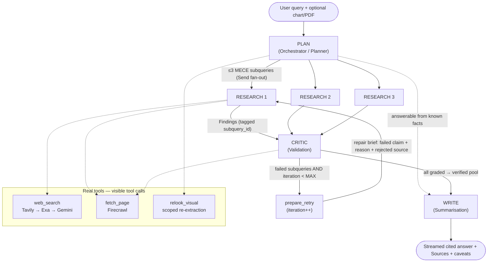
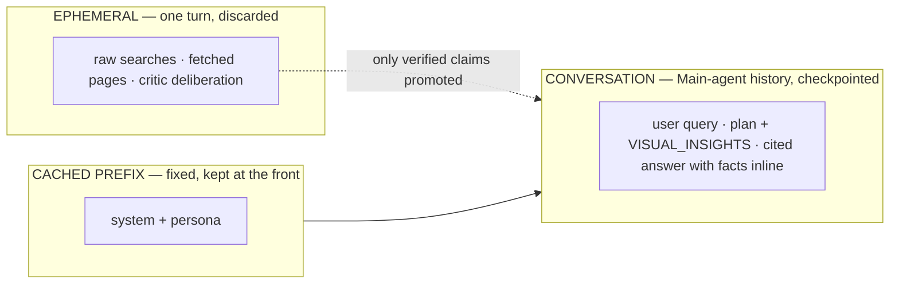

# Architecture

A chat-based, **multi-agent research assistant** (general-purpose) built on **LangGraph +
Gemini**. It takes a research problem plus an optional visual (a real Ofcom/TRAI chart or PDF),
decomposes it into mutually-exclusive subqueries, gathers and **validates** web evidence across
parallel agents, and streams a structured, **cited** answer. Follow-up turns build on prior turns
within an isolated session. The system is domain-neutral; **customer experience (CX) is the
demonstrated use case**, not a hardcoded specialisation.

This document describes both what is **built** for the assessment (the simple, demo-correct path)
and, where relevant, what would be **added to scale** in production — each deferred item carries a
"build-when" trigger so the path forward is explicit. Deferred items are *designed*, not built.

---

## 1. Agent topology

Five LangGraph nodes implement four named agent roles. A single **Main agent** owns the
conversation and runs two phases — `plan` (decompose) and `write` (synthesise); between them sits a
quarantined "fact-finding" stage of parallel `research` workers and a single `critic` that
validates. Failed subqueries loop back once in repair mode.

**Why this shape.** `plan` and `write` share the same persona and conversation history but are
genuinely *different* steps at different pipeline points (before vs after research), so they cannot
be a single call — yet they add nothing as separate personas, so they are merged into one Main
agent. That keeps memory simple: a single maintained history. `research` + `critic` are a
**quarantined verified-fact-finding stage**: noisy gathering (raw searches, fetched pages, critic
deliberation) never reaches the main context — only clean, validated claims do. Exposing four named
nodes gives clear role separation; the supervisor → parallel-fan-out → validating-join (that can
send work back) is a *stronger* interaction story than a linear pipeline.

## 2. Agent roles & interactions

| Agent (node) | Role | Reads | Tools | Produces |
|---|---|---|---|---|
| **`plan`** | Orchestrator / Planner | history, the latest question, any attached file | vision (combined extract + decompose), `relook_visual` | ≤`MAX_SUBTASKS` MECE subqueries + `visual_insights`; resets the turn's working state |
| **`research`** (×N, parallel) | Research | its own focused input (one subquery + optional repair brief) — *not* the shared chat | `web_search`, `fetch_page` | `Finding`s (claim + source + evidence), tagged by `subquery_id` |
| **`critic`** | Validation | all merged findings + the question | `fetch_page` (to verify) | per-finding `{grounded, confidence, issue}`; approves → `verified` pool, fails → repair briefs |
| **`write`** | Summarisation | the `verified` pool + history | none (single streaming call) | a cited prose answer + deterministic caveats |

**Interaction patterns.** (1) **Fan-out / fan-in** — `plan` emits parallel branches; their findings
merge through a reducer barrier the `critic` reads. (2) **Validating join with feedback** — the
`critic` partitions findings and re-fires *only* failed subqueries with a targeted brief
(self-correction). (3) **Agentic tool loops** — `plan`/`research`/`critic` choose their own tool
sequence (and may issue parallel tool calls in one step), not fixed single-shot calls.

## 3. Orchestration — parallel map-reduce with a bounded retry

`plan` splits the question into ≤`MAX_SUBTASKS` (=3) **MECE** subqueries — *mutually exclusive* (no
duplicate searching) and *collectively exhaustive* (the gap is fully covered). MECE is
**prompt-enforced** (no programmatic check). These fan out to parallel `research` branches; each
branch returns `Finding`s tagged with its `subquery_id`, and the findings merge through an
append/reset reducer into one list — the **fan-in barrier** the single `critic` reads.

The `critic` grades each finding for grounding + confidence; approved findings accumulate in a
`verified` pool, and failed ones produce a `retry_list` of repair briefs. If any subquery's claims
fail **and** `iteration < MAX_RESEARCH_ITERATIONS` (=1), **only those subqueries re-fire** in
*repair mode*; otherwise the complete `verified` pool goes to `write`. Anything still unverified
after the retry is dropped and surfaced as a `caveat`.

- **Retry granularity is per *subquery*** (the routing key is `subquery_id`), even though claims are
  validated *individually* — a search is scoped to a sub-topic, not a single claim. State uses an
  **accumulator** (`verified`) plus a **shrinking worklist** (`retry_list`), so approved claims are
  never re-judged and there is no append/dedupe problem.
- **Iteration semantics.** `iteration` = retries done, starts at 0. The failed edge fires while
  `iteration < MAX_RESEARCH_ITERATIONS` and **increments on each re-fire**, so `MAX=1` ⇒ pass-1
  (iter 0 → retry) then pass-2 (iter 1, not `<1` → write) = exactly one retry / two passes.
- **Edge rules.** N subqueries is **1–`MAX_SUBTASKS`** (plan-decided; the graph handles N<3). A
  branch returning **zero grounded findings** counts as a failed subquery → retry. If `plan`
  decides the question is fully answerable from known facts, it returns an empty subquery list and
  the graph routes straight to `write`.

**Why a single bounded retry.** A dropped subquery is a third of the answer, so one targeted retry
recovers coverage cheaply and adds a visible self-correction beat — at near-zero extra mechanism
over a pure filter. Capping fan-out at 3 bounds rate-limit risk on free keys.

## 4. Agentic nodes & the three bound layers

`research`, `critic`, and `plan` are **tool-calling agents**, not single-shot calls: the model is
given the tools and chooses the sequence — research may search → reason → fetch → search again
before emitting findings; critic may fetch a page to verify a claim mid-judgement; plan may re-look
a visual. The model may also issue **parallel tool calls** in one step, executed concurrently
(tool-level parallelism on top of the branch-level fan-out). Adaptive multi-step tool use beats a
fixed search→answer orchestration and makes the live trace richer. Each agentic node ends with one
final **structured** call (a validated typed container); `write` is a single **streaming** prose
call with no tools and no structured output.

Three nested bound layers keep agents safe and the turn terminating:

1. **Per-agent invocation** — `max_steps` (reasoning↔tool cycles) + `max_tool_calls` (total calls),
   set per agent and **reset on every entry/handoff**: plan 4/8, research 5/10, critic 10/30 (it
   grades all branches), write 1/0. Hitting either returns **partial results** (a branch with no
   grounded findings → failed subquery → retry), never a crash.
2. **Loop level** — `MAX_RESEARCH_ITERATIONS` (=1), the critic↔research retry count.
3. **Graph level** — a LangGraph `recursion_limit`, a global backstop so the turn always terminates.

The native per-agent step bound is the inner agent's recursion limit, set to `2 × max_steps + 1`
(the framework counts model and tool turns separately); the agent degrades gracefully near the
limit (returns a partial answer rather than erroring). `max_tool_calls` — a hard *volume* cap —
is enforced by a small counting wrapper that refuses further tool calls past the cap.

**Rejected:** code-orchestrated single tool calls (deterministic and simpler, but research becomes
a one-shot search→answer with no adaptive follow-up — weaker answers and a flatter trace). The
earlier worry that orchestration was needed for reliable UI events is moot: routing tools through
the framework's tool loop emits the tool/stream events automatically.

## 5. Multimodal

The `plan` phase makes a Gemini **vision** call on an attached chart/PDF and extracts a structured
`visual_insights` block — the figures the source encodes (e.g. complaint rates / NPS per operator).
This is **load-bearing**: the data lives *inside* the visual, so reading it drives the plan and the
final answer. A visual may arrive on **any** turn, not just the first.

**One combined call.** A visual newly attached this turn is included directly in the `plan` call,
which extracts `visual_insights` **and** decomposes into subqueries in **one combined multimodal
call** — no separate vision pass. A file present only in the manifest (from a prior turn) is reached
via the `relook_visual` tool. Initial extraction is auto-triggered by an attachment; re-look is
LLM-invoked.

**Extract-once-to-text.** Vision runs once, when the visual arrives; the extracted text is folded
into the conversation history and carried forward from there. Raw bytes are **not** kept in context
and vision is **not** re-run on later turns. This fits the memory model (history is just the Main
agent's conversation), keeps the implicit prefix cache warm as turns append, and needs no file
hosting — images are inlined only on the turn they arrive.

**Type-aware extraction:**

| Input | Extraction | Why |
|---|---|---|
| Image / chart | **Exhaustive** — full underlying table, axis labels, legend, annotations, every data point + trend | Small enough to capture faithfully in one pass; the text becomes a near-complete proxy, so no detail is lost when the bytes are dropped |
| PDF | **Query-scoped** — only the figures/pages relevant to the question, recording *which pages* were read | Faithful full transcription of a large doc is lossy; a narrow extraction against a known question stays accurate |

A dense multi-chart **dashboard image** is treated as the PDF case (scope to the relevant panel).

**Pinning & re-look.** `visual_insights` is written into the conversation as a delimited, tagged
block — `[[VISUAL_INSIGHTS id=… source=… type=…]] … [[/VISUAL_INSIGHTS]]`. The marker (not its
position) is what makes it preservable through future history compaction: the rule is "carry
`[[VISUAL_INSIGHTS]]` blocks verbatim, summarise the rest", so scattered/multiple blocks across
turns are all preserved. A small **artifact manifest** — `{file_id, local_path, type, descriptor,
turn}`, **no bytes** — sits in context so the model knows what it can re-open; `relook_visual(file_id,
focus)` loads the file from local disk, makes a *scoped* vision call, and appends a new pinned
block. Re-look is the safety net for the PDF/dashboard case (scoped extraction is deliberately
partial); for single images it rarely fires.

**Rejected:** keeping the native image in context every turn (window-budget cost across multi-turn
sessions — cached tokens still occupy the window and bill at ~25% — and needs a File API or
re-inlining large bytes); and a Gemini File API handle (hosting/TTL for no benefit once we extract
to text). The accepted residual risk: detail neither the first extraction nor a re-look captured
cannot be recovered later — the writer flags such gaps as caveats.

## 6. Memory & state model

Agents are **stateless functions** of a typed `GraphState`. Memory has three tiers:

The maintained conversation is the **Main agent's history** (the standard messages list with an
append reducer). Each turn appends: the user query, the plan output (chosen subqueries + any
`[[VISUAL_INSIGHTS]]` block), and the cited answer — the verified facts + sources are carried
**inline** in that answer, so continuity needs no separate fact object. Research/critic chatter is
never persisted. On a follow-up, deciding what is *already known* vs a *genuine gap* is **LLM
judgment** by `plan` reading this history — there is no programmatic dedup.

**Reducers.** `findings` needs a reducer because parallel branches write it concurrently (the
fan-in barrier); `None` is the reset/consume signal — `plan` resets `findings`/`verified` at turn
start, and `critic` returns `findings=None` to *consume* what it graded so a retry pass sees only
fresh findings. `subqueries`/`retry_list`/`iteration` are single-writer (plain keys). Per-branch
inputs ride a dedicated small schema (one subquery + optional brief), never the full shared state —
the standard map-reduce practice.

**Why facts inline + history-only memory.** It keeps continuity airtight (prior facts stay reachable
by reading the prior cited answer), gives the visible citation/grounding block, honours streaming,
and avoids duplicating the `verified` set. To answer turn N+1 the model needs only prior plan/write
turns — normal chat-agent memory, nothing custom.

**Deferred (scaling).** Long-session **compaction** (keep system+persona and the most recent N
turns verbatim; fold older turns into a bounded rolling summary that preferentially preserves
verified facts + sources, pinning `[[VISUAL_INSIGHTS]]` out of summarisation) and a **vectorless,
LLM-navigable wiki index** over saved facts. Both are unnecessary for demo-length chats (a demo
never reaches the token threshold) and would churn the cache if run per turn — so they run only at
the compaction trigger. **Build when:** sessions run long enough to approach the working-context cap.

## 7. Multi-session isolation

Each chat session is one LangGraph `thread_id` with an **`AsyncSqliteSaver`** checkpointer (the app
is async). Threads are **fully isolated** — one session's memory never touches another's. The
checkpointer also gives resume-after-crash and time-travel/replay cheaply. **Build when** more than
one app instance is needed: swap the SQLite saver for a Postgres saver (durable, multi-instance,
shared state) — a near-drop-in change because nodes are stateless.

## 8. Tools (the real-tool requirement)

- **`web_search`** — tries providers in order (**Tavily → Exa → Gemini Google Search**), falling
  back on failure/rate-limit, normalising every provider to one result shape. External providers
  are **self-wired integrations** that fire as *visible tool calls* (essential for the live trace)
  and give raw results we form findings from. Gemini's built-in Google Search is the **keyless last
  resort** — it searches inside the model call (no discrete tool event and it bakes in synthesis,
  so it is a weaker *primary*) but needs no extra key, so search still works even if external keys
  fail or are never configured. A provider is skipped if its key is unset.
- **`fetch_page`** — turns a URL into clean markdown (via Firecrawl) so the critic can **open and
  verify** a cited source rather than trust a snippet — the independent source-verification path
  that grounding metadata can't provide.
- **`relook_visual`** — re-opens a previously uploaded file from the manifest for a scoped
  re-extraction (the PDF/dashboard safety net of §5).

Every tool is defensive (timeouts, typed returns, no raised secrets) and wraps its own output in an
`<untrusted>` fence (§9). There is **no cross-session result cache**: a research assistant's value
is *fresh* results, and a persistent cache would buy staleness + invalidation logic; a follow-up
that needs the same source re-fetches.

## 9. LLM access & key policy

Access is via LangChain's `ChatGoogleGenerativeAI`, which provides the agentic tool loop, streaming,
tool events, and structured output (`with_structured_output`) with minimal code. Gemini gives a free
tier, native multimodal (reads chart images and PDFs directly), structured output, and thought
summaries — one provider covering reasoning + vision. (Text-only / weak-vision models were rejected
because they can't satisfy the mandatory multimodal requirement.)

**Keys — simple rotation, resume-on-failure.** The keys are one **equal pool**. On a rate-limit the
call rotates to the next key and retries — at the granularity of a **single model call**, and it
**preserves agent progress**: agentic nodes compile their tool-loop agent with a per-invocation
inner checkpointer and inner thread; on a mid-loop key failure the failing key is cooled/rotated/
dropped, the agent is **rebuilt with the next key + the same checkpointer, and resumed from its last
checkpoint**. A mid-loop 429 then costs ~one model call, not the whole agent (prior tool results +
reasoning survive). The non-agentic `write` call simply retries with the next key. This keeps the
stock chat model (so streaming/tool-binding/structured-output are untouched). The cost — per-key
implicit caching mostly does not stay warm — is accepted for free keys.

**Robust error classification.** One wrapper around every LLM call classifies failures and acts:

| Failure | Action |
|---|---|
| Rate limit (429, transient) | rotate to the next key, retry |
| Daily quota exhausted | cool the key (skip until expiry), rotate, retry |
| Auth / invalid key (401/403) | **drop** the key from the pool, rotate, retry |
| Transient 5xx / timeout / network | exponential backoff + bounded retry; rotate if it persists |
| Bad request / safety / schema | surface it — not a key problem, don't rotate |
| All keys down | raise → graceful degradation (clean message) + an all-keys-exhausted signal |

Every call carries a timeout; dead/cooling keys are skipped; logs record the key **index**, never
the key value.

**Thinking & model config.** Gemini 3 Flash's real window is large; we treat a 256k working-context
cap as a safety ceiling (enforced by compaction, not an API knob — never approached in a demo) and
set `max_output_tokens` explicitly. **Thinking is tiered per node:** `high` for `plan`, `critic`,
and `write` (decomposition, the grounding guardrail, and the visible output are quality-critical),
`medium` for `research` (mostly tool-driven retrieval, and the ×3 parallel free-tier hotspot — keep
it lighter). High thinking on the other nodes also makes the streamed thinking panes richer.

**Deferred (scaling).** Replace simple rotation with a fixed primary kept implicit-cache-warm for
the Main `plan`/`write` calls + dedicated keys leased per parallel research branch. **Build when:**
off free-tier keys, where cache warmth and throughput start to matter.

## 10. Guardrails & evaluation

**Runtime guardrails** (how incorrect/hallucinated outputs are caught and how agents validate each
other):

| Guardrail | Mechanism |
|---|---|
| **Grounding** | Every finding must carry a source; the critic re-reads each claim against its evidence (and may fetch the URL) — uncited or unsupported ⇒ `grounded=false` ⇒ failed. |
| **Per-finding confidence gate** | A finding is **approved iff `grounded AND confidence ≥ CONFIDENCE_THRESHOLD`** (=0.7); only approved claims reach the writer. (A mean confidence is computed for *reporting* only, to drive caveats — not the gate.) |
| **Bounded self-correcting retry** | Failed subqueries re-fire once in repair mode with a targeted brief; still-unverified claims are dropped → caveats. |
| **Untrusted-content fence** | Search/fetch output is wrapped in `<untrusted>…</untrusted>` and the system prompt instructs every agent to treat it as data, never instructions (prompt-injection guard). |
| **Schema validation** | Structured outputs are validated typed objects; malformed output is retried once, then degraded — never crashes. |
| **Graceful degradation** | All keys exhausted, an agent hitting its step cap, or an empty verified set all degrade to a clean, caveated answer rather than an error. |

**Offline evaluation** (measurement, distinct from the runtime guardrails). An **LLM-judge** (low
temperature) runs the full graph on a golden set and scores, on a 0–1 scale: **groundedness** (is
each verified finding actually supported by its cited source?), **coverage** (are the expected
aspects / subquestions answered?), and **citation completeness** (does every claim in the answer
carry a source?). On the two golden cases — a CX Ofcom-chart worked example and a general text-only
query — it scored **1.00 / 1.00 / 1.00**. *(The eval harness and the deterministic test suite are
exercised in development; this code bundle ships the application only.)*

## 11. Observability & monitoring

A per-call `StepTrace` records: latency, input / output / cached / thinking tokens, estimated cost,
the key **index** (never the key), iteration, and tool calls. (`output_tokens` already includes
thinking tokens, which bill as output; the cost estimate prices input + output per million and
applies a ~25% discount on the cached-input portion.) An end-of-run **per-agent summary table**
prints after every turn.

This trace is the monitoring data source:

- **Quality** = aggregate confidence, re-research rate, eval scores.
- **Cost** = tokens × price, per agent.
- **Latency** = per-node `latency_ms`.
- **Alerts** on: confidence drop, cost spike, tool error-rate, all-keys-exhausted.

What the model *remembers* (§6) and what a human can *inspect* are separate concerns: the ephemeral
research/critic loop is excluded from agent memory but is fully visible live because the UI renders
the event stream, not memory. Optional **LangSmith** tracing is env-toggled (no code change), and
persisting traces for post-hoc replay is an independent choice. **Build trace persistence when:**
post-hoc inspection or audit is required.

## 12. Frontend & streaming

A **Chainlit** UI (Python-only, no React/Node build) renders a nested, live agent trace driven by
the framework's streaming event source, which emits everything the UI needs: token deltas (thinking
+ output) per agent, node open/close → a (nested) step, and tool start/end → a row under that agent.
The ≤3 `research` branches stream **concurrently**, so each event is keyed by its run id to route
tokens into the correct branch's step — the tree shows plan → (3 parallel research) → critic →
(retry) → write, with the parallel branches rendering as siblings updating at once. **Thinking** is
shown via Gemini thought summaries when present; absence degrades gracefully (no pane). The final
answer streams under the writer step, followed by a Sources list and any caveats. Live streaming
needs no persistence — the in-memory loop streams as it runs.

**Why Chainlit.** The expensive part of a multi-agent UI is the nested, streaming agent tree;
Chainlit provides that for free (nested steps + token streaming), so the only work is mapping
events → steps (Python we write anyway). A custom React/Next stack (or CopilotKit) was rejected as
the same effort as building the trace from scratch unless a polished React product is itself a goal;
a plain server framework was rejected because you'd hand-build the whole streaming tree and sync
would fight the async event stream.

## 13. Production scaling — what changes & when to build

| Area | Production change | Build when |
|---|---|---|
| Concurrency | lift the subquery cap, queue research jobs, add keys / a paid tier | throughput outgrows a 3-wide, few-key fan-out |
| Key strategy | sticky cache-warm primary + per-branch leased keys | off free-tier keys |
| Compaction | rolling summary with pinned visuals (§6) | sessions approach the working-context cap |
| Wiki index | vectorless LLM-navigable index over saved facts | compaction exists and summary loss bites |
| Cross-session KB | embeddings / vector store (only here do they earn their place) | findings must be reused across sessions |
| Durable state | Postgres checkpointer | more than one app instance |
| Model tiering | a stronger model on low-confidence re-research | quality/cost tuning warranted |
| Trace persistence | Chainlit data layer / a trace store | post-hoc inspection or audit required |

Nodes are stateless → containerise; the parallel research fan-out and the critic join scale
horizontally.

## 14. CX application

The agent is general; we **demonstrate** it on CX. Fed a real Ofcom/TRAI complaints/QoS chart, it
identifies the worst-performing operator and worsening driver, researches causes, peer benchmarks,
and regulatory context, and writes a cited remediation brief. The same workflow covers
**complaint-driver analysis, NPS root-cause, and call-centre insights** — chat follow-ups let an
analyst drill in ("just prepaid", "how could operators collaborate") without re-running the
research from scratch. Real regulator reports are used as input because their figures live *inside*
charts, making the vision step genuinely necessary (made-up dashboards would not).

## 15. Key design decisions & trade-offs

- **Framework: LangGraph.** The control flow is simple, but an open-source framework is mandatory,
  and LangGraph is the least opinionated of the candidates — we own the state dict and key rotation,
  and get a checkpointer, an auto-rendered graph diagram, and a clean streaming event source.
  *Rejected:* CrewAI (opinionated roles resist a parallel fan-out → single validating join with
  per-finding gating + bounded retry; its tool-mediated multimodal path has known image-as-text
  bugs — risky for a mandatory requirement); AutoGen (a legitimate alternative — group-chat fits a
  research/critic exchange and `config_list` gives multi-key fallback — but LangGraph's explicit,
  inspectable graph + per-node streaming map more directly to the graded diagram and recording);
  plain Python (fails the framework requirement).
- **Merged Main agent + single critic filter.** `plan` and `write` share one persona/history, so
  merging them simplifies memory to a single maintained history; a single critic filtering the
  gathered map (rather than a per-branch critic) is simpler and still fully validates each claim.
- **Retry by targeted brief, not carried conversation.** A re-fired branch gets the distilled failed
  *claim* + *why* it failed + *what not to reuse* — compact, and all already produced by the critic
  — rather than its prior conversation. This keeps research stateless and chatter ephemeral, avoids
  re-sending large context, and keeps the UI clean (~95% of the focus at ~5% of the cost). If briefs
  ever prove insufficient, carrying the branch conversation is the documented fallback.
- **Streaming cited answer with facts inline; conversation = Main-agent history only.** Honours the
  live-streaming UX, keeps continuity without a duplicate fact object, and stays normal chat memory.
- **General agent; CX demonstrated.** The brief asks us to *apply* the system to CX, not build a
  CX-only tool — domain-neutral prompts generalise to any research problem; CX is the showcased run.

## 16. Worked example (end-to-end)

**Turn 1 — input:** an Ofcom/TRAI chart + *"Why are complaints climbing for Operator A, and what
should they do?"* (`MAX_SUBTASKS=3`, `CONFIDENCE_THRESHOLD=0.7`, `MAX_RESEARCH_ITERATIONS=1`).

1. **PLAN** — vision → `visual_insights` (e.g. the worsening driver and its magnitude). Decompose
   into 3 MECE subqueries: causes / benchmark vs peers / remediation. State reset: `verified=[]`,
   `iteration=0`. Fan out ×3.
2. **RESEARCH ×3 (parallel)** — each branch runs `web_search` → `fetch_page`, emitting findings
   tagged by subquery; merged via the reducer. Some are strong, some weak (a thin blog, a vague
   claim).
3. **CRITIC pass 1** — grades grounding + confidence; approves the strong findings into `verified`;
   builds repair briefs for the failed subqueries (e.g. "claim X unsupported, drop source Y"; "need
   a quantified figure"). `iteration 0 < MAX` ⇒ retry.
4. **RESEARCH retry (repair mode, only the failed subqueries)** — re-research against the brief
   (stronger/authoritative sources), emitting new findings.
5. **CRITIC pass 2** — re-grades; the verified pool is complete; `retry_list` empty (and
   `iteration == MAX`) ⇒ write.
6. **WRITE (one streaming call)** — a cited answer over the verified pool; sources render as a
   Sources list; any unverifiable aspect is a caveat. Append `[query, plan, cited answer]` to
   history.

**Turn 2 — continuity:** *"What about just prepaid subscribers?"* `plan` reuses the in-context
`visual_insights` + prior verified facts, emits only the genuine gap (prepaid-specific drivers),
runs one research → critic → write, and synthesises old + new. **No vision call** — the insights
persist as text.

The whole flow is visible live in the UI as a nested trace, and the retry loop is observable.

## 17. Configuration reference

Behavioural knobs (defaults shown; set via `.env`):

| Knob | Default | Meaning |
|---|---|---|
| `MODEL_NAME` | `gemini-3-flash-preview` | the Gemini model |
| `GEMINI_API_KEYS` | — | comma-list of keys; rotate-on-rate-limit across the pool |
| `MAX_SUBTASKS` | 3 | cap on parallel subqueries; actual N is 1–this |
| `MAX_RESEARCH_ITERATIONS` | 1 | retries after the first pass (total passes = this + 1) |
| `CONFIDENCE_THRESHOLD` | 0.7 | per-finding approve threshold |
| `{PLAN,RESEARCH,CRITIC}_MAX_STEPS` | 4 / 5 / 10 | per-agent reasoning↔tool cycles, reset per invocation |
| `{PLAN,RESEARCH,CRITIC}_MAX_TOOL_CALLS` | 8 / 10 / 30 | per-agent total tool calls, reset per invocation |
| `RECURSION_LIMIT` | 50 | graph-level backstop on total node executions |
| `MAX_OUTPUT_TOKENS` | 8192 | explicit output cap |
| thinking levels | plan/critic/write = high, research = medium | per-node (not a single env var) |
| `SEARCH_PROVIDER_ORDER` | `tavily,exa,gemini` | search fallback order |
| `TAVILY_API_KEY` / `EXA_API_KEY` / `FIRECRAWL_API_KEY` | — | provider keys; Gemini fallback is keyless |
| `DB_PATH` | `./.runtime/checkpoints.sqlite` | session checkpoint store |
| `REQUEST_TIMEOUT` | 60 | tool / LLM call timeout (seconds) |
| `PRICE_INPUT_PER_M` / `PRICE_OUTPUT_PER_M` | — | per-million-token prices for the cost estimate |
